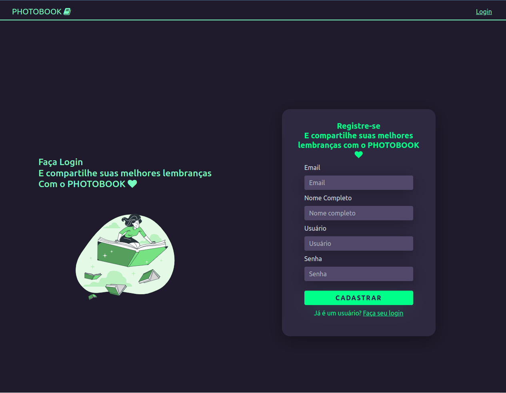

# PHOTOBOOK

<h1>
  
  
  
</h1>

---

## Indice

- [PHOTOBOOK](#photobook)
  - [Indice](#indice)
  - [Sobre](#sobre)
  - [Funcionalidade da Aplicação](#funcionalidade-da-aplicação)
  - [Tecnologias utilizadas](#tecnologias-utilizadas)
  - [Como baixar o projeto](#como-baixar-o-projeto)
  - [Autor](#autor)
  
---

## Sobre 

O Projeto **PHOTOBOOK** foi desenvolvido como segundo projeto da mentoria **Conquiste sua vaga**. O projeto tem a finalidade de utilizar as melhores práticas para a tela de login, utilizando o Angular. O estilo da pagina foi utilizando o CSS, com cores no estilo dark. 

O **PHOTOBOOK** tem a tela de cadastrar imagens, mas essa parte de cadastrar as fotos ainda está em desenvolvimento. As imagens no inicio da pagina é como exemplo para ilustrar o possivel resultado final.


---

## Funcionalidade da Aplicação

A aplicação exemplo consiste em criar um cadastro de imagens com tela de login com as melhores práticas do Angular.
com as seguintes funcionalidades:
- Cadastrar fotos (Em desenvolvimento)
- Remover Fotos (Em desenvolvimento)
- Listar fotos

---
## Tecnologias utilizadas 

O projeto foi desenvolvido utilizando as seguintes tecnologias
- [Angular 12](https://angular.io/)
- [Bootstrap 5](https://getbootstrap.com/docs/5.0/getting-started/introduction/)
- JavaScript
- TypeScript
- HTML
- CSS

---

## Como baixar o projeto

```bash
# Clonar o repositório em sua máquina 
$ git clone https://github.com/francelinom/photobook.git

# Entrar na pasta do projeto 
$ cd photobook

# Instalar todas as dependências 
$ npm i

# Iniciar o projeto 
$ ng serve
```
---
## Autor

Desenvolvido por **Francelino Marcílio da Silva** 
<h1>
  
</h1>
